## Introducción

Esta asignacion se basra en realizar todo el trabajo previo para poder empezar a utilizar VSCode, un editor de texto flexible con potencial de entorno de desarrollo. Para ello, se revisará como instalarlo, que extensiones son las mas comunes, leer un pequeño tutorial sobre VSCode, configurarlo para conectarse por SSH a una máquina remota, en nuestro caso a la maquina virtual que configuramos en la práctica anterior, configurar las sesione colaborativas con Visual Studio Live Share, y, por último, sumergirnos levemente en el mundo de TypeScript, un superconjunto de JavaScript que añade tipos estáticos y objetos basados en clases, con un sencillo ejemplo.

## Objetivos

- Realizar las tareas previas
- Instalar y estudiar la funcionalidad de Visual Studio Code
- Configurar de Visual Studio Code para conectarse a una máquina remota por SSH
- Configurar las sesiones colaborativas con Visual Studio Live Share
- Desarrollar el primer proyecto en TypeScript: “Hola Mundo”

## Tareas previas

En línea con lo realizado en la practica anterior y teniendo en cuenta que los objetivos previos son los mismos, las tareas previas ya están realizadas.

## Instalacion y funcionalidad de Visual Studio Code

No fue necesario realizar la instalación de Visual Studio Code, ya que ya estaba instalado del año pasado.

Si que fue necesario instalar el compilador de TypeScript, ya que era una de las instalaciones recomendadas por el primer link del tutorial de VSCode:

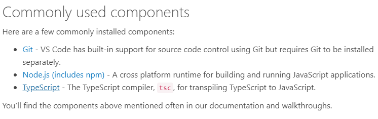

Se siguió el proceso de [instalacion recomendado](https://code.visualstudio.com/docs/languages/typescript) por la web de VSCode:

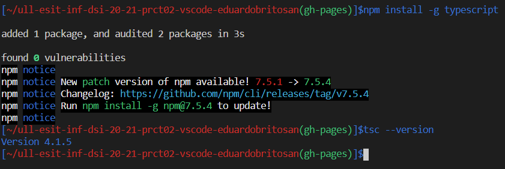

También se instaló la extension de ESLint a través del [Visual Studio Marketplace](https://marketplace.visualstudio.com/items?itemName=ms-vscode.vscode-typescript-next):

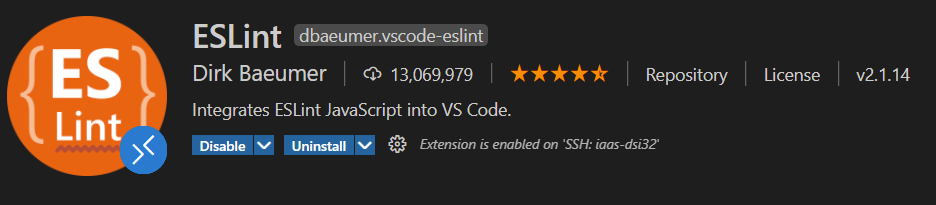

## Configuración de Visual Studio Code para conectarse a una máquina remota por SSH

Respecto a esta configuración, tambien estaba realizada del año anterior, siendo visible en la captura de pantalla que estamos conectados por ssh a la máquina virtual utilizando VSCode.

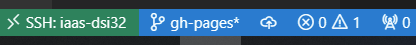

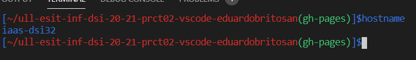

## Sesiones colaborativas con Visual Studio Live Share

Las sesiones colaborativas estaban instaladas del año anterior, aunque no estaban instalados todas las herramientas recomendadas (Browser Preview, GitHub Pull Requests, Live Server Pomodoro, etc.) así que fueron instaladas a través del buscador de extensiones de VSCode.

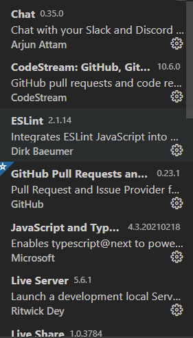

## Primer proyecto en TypeScript: “Hola Mundo”

Nos podemos saltar la instalacion de TypeScript recomendada en el guión puesto que ya la realizamos en el primer paso.

Se ejecutan los comandos que nos piden en el guión, para poder incicar el proyecto de prueba de TypeScript.

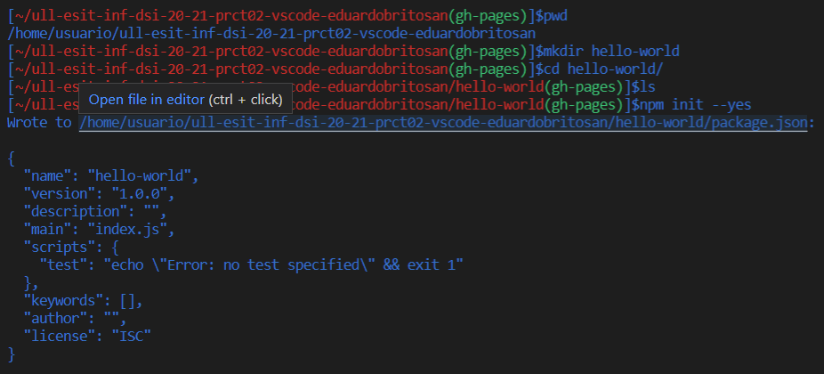

El siguiente paso es crear el fichero tsconfig.json en donde se pasaran los parametros con los que se compilara el TypeScript a JavaScript.

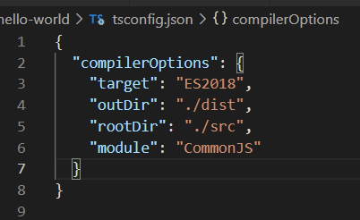

Se creará una carpeta **src** en donde tendremos el código en TypeScript, que al compilarse se transformará en JavaScript que se almacenará en la carpeta **dist** de manera automática.

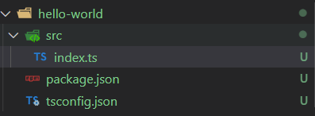

Por ultimo, compilaremos el código en la terminal de VSCode:

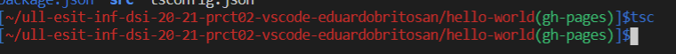

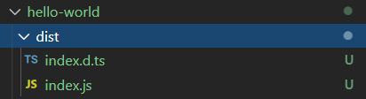

## Conclusiones

En general fue una practica sencilla de realizar, en donde la mayoria del trabajo se baso en recopilar la informacion y las imagenes necesarias para generar un informe competente. A pesar de ello, se encontraron incovenientes cuya investigacion sigue abierta, como la interaccion de ciertas extensiones con el entorno del IaaS.

## Bibliografía

TypeScript (s.f.). En _Wikipedia_. Recuperado el 23 de febrero de 2021 de https://es.wikipedia.org/wiki/TypeScript
